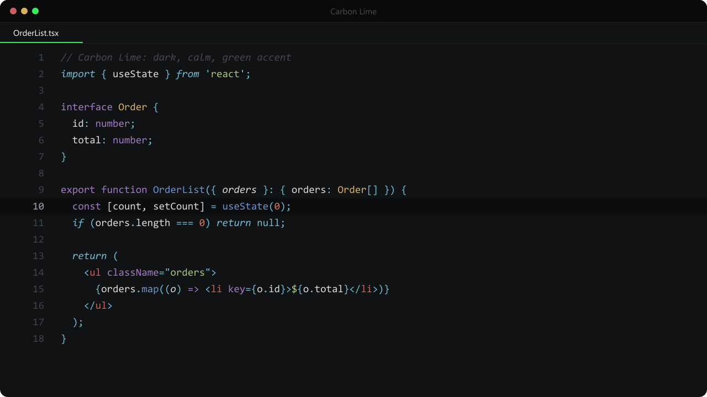

# Carbon Lime

A calm, near-black dark theme for VS Code with a vivid green accent.

Carbon Lime only paints colors. It does not ship or force an icon theme, so it pairs with whatever file icons you already like.



## Install

1. Open the Extensions view (`Ctrl+Shift+X`).
2. Search for **Carbon Lime** and install it.
3. Run **Preferences: Color Theme** (`Ctrl+K Ctrl+T`) and pick **Carbon Lime**.

## Palette

| Role | Color |
| --- | --- |
| Editor background | `#101213` |
| Sidebar, activity bar, status bar | `#0A0A0A` |
| Borders | `#1D2122` |
| Text | `#D9D9D9` |
| Accent | `#39EA5F` |
| Comments (italic) | `#45454A` |
| Keywords | `#A178C4` |
| Control flow (italic), operators | `#6EBAD7` |
| Functions | `#6A90D0` |
| Strings | `#A3C679` |
| Numbers, constants | `#CD775C` |
| Classes, types | `#D5B05F` |
| HTML tags | `#C85E60` |
| CSS properties | `#90A9BC` |

## Change the accent

Every accent surface can be overridden from your `settings.json`:

```jsonc
"workbench.colorCustomizations": {
  "[Carbon Lime]": {
    "activityBar.activeBorder": "#FF7042",
    "tab.activeBorder": "#FF7042",
    "button.background": "#FF7042"
  }
}
```

## Optional UI extras

The `extras` folder holds the CSS and JS I use on top of the theme:

- Centered command palette with rounded corners and a blurred backdrop.
- Rounded, gradient hover tooltips.
- Cleaner title bar, sidebar and explorer selection.
- A custom logo on the empty editor background.

VS Code does not let a theme inject CSS or JS, so these extras need a separate loader extension. They are 100% optional.

1. Download [`carbon-lime.css`](extras/carbon-lime.css) and [`carbon-lime.js`](extras/carbon-lime.js) to a folder that will not move, for example `C:/vscode-extras/`.
2. Install the [Custom CSS and JS Loader](https://marketplace.visualstudio.com/items?itemName=be5invis.vscode-custom-css) extension.
3. Add this to your `settings.json`, pointing to your folder:

   ```jsonc
   "vscode_custom_css.imports": [
     "file:///C:/vscode-extras/carbon-lime.css",
     "file:///C:/vscode-extras/carbon-lime.js"
   ]
   ```

4. Run **Enable Custom CSS and JS** from the command palette and restart VS Code.

Things to know before you enable it:

- VS Code will warn that your installation "appears to be corrupt". That is expected, because the loader patches VS Code's own files. Choose "Don't show again".
- After every VS Code update, run **Reload Custom CSS and JS** again.
- The extras use the fonts **Geist Sans**, **Geist Mono** and **Monaspace Radon**. Install them, or edit the `font-family` lines.
- To undo everything, run **Disable Custom CSS and JS**.

## License

[MIT](LICENSE)
